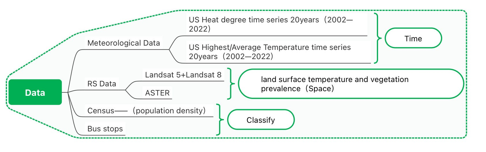
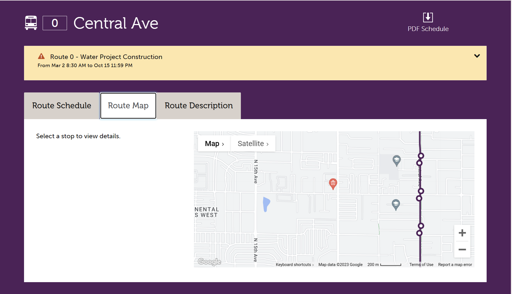

# Content

1. Problem 

2. Approach 

3. Project Management 

---

class: inverse, center, middle
# Problem 
## Problem Definition 
## Policies 
## Term Explanation

---

# Problem Definition
## Urban Heat Island (UHI) in Phoenix, Arizona
- "the country's hottest and fifth populous city" (https://www.theguardian.com/us-news/2022/jan/27/phoenix-arizona-hottest-city-cooling-technologies)
- Urbannisation as the maindriver of UHI - conversion to urban, residential and impervious surfaces (citation )
- The population growth has led to a huge expansion in concrete infrastructure (buildings, roads and carparks) and a reduction in green areas, which has created heat islands – dangerously hot urban areas that absorb and re-emit the sun’s heat more than natural landscapes.

- 53 days above 113°F (43°C) in 2020 ()


```{r echo = FALSE, out.width='75%', fig.align='center'}
knitr::include_graphics("uhi.jpg")
```


---

# Cost of the UHI in Phoenix

## Environmental 

## Public Health

- Tends to be most intense in the low income areas - more than half of the people who died in 2020 from heat were homeless [add citation]
- Mean 

```{r echo = FALSE, out.width='75%', fig.align='center'}
knitr::include_graphics("death.png")
```

---

# Cost of the UHI in Phoenix

## Economic

**City Level**

```{r echo = FALSE, out.width='60%', fig.align='center'}
knitr::include_graphics("cost.png")
```


---

# Global Policies regarding UHI

## New Urban Agenda

- "reducing the financial, environmental and public health costs of inefficient mobility, congestion, air pollution, urban heat island effects and noise"

## SDGs 

- "Investing in parks and green spaces in urban areas will help to ameliorate the urban heat island effect and improve air quality in urban spaces."

---

# Local Policies regarding UHI 

## Phoenix Climate Action Plan

### Heat Section - 2050 goal

- Reduce urban heat-island effect through *green infrastructure as well as doubling the current tree and shade canopy to 25% (add citation )

* green infrastructure - 


---

# Benefit of the UHI in Phoenix 

```{r echo = FALSE, out.width='75%', fig.align='center'}
knitr::include_graphics("benefit_cost.png")
```


---

# UHI and Transporation 

**Cause**
- low density city structure based urban sprawl into the deserts increases car usage (citation)
- car 

**Impact**
- community efforts and interventions demonstrating high reliance on public transport in low-income communities found vulnerable to heat [add citation]

**Current Efforts**
- Phoenix 2050 Transportation Plan - Providing shade structures to bus stops https://www.phoenix.gov/publictransitsite/MediaAssets/T2050_flyer.pdf
- Current criteria for prioritisation mainly on ridership with little attention on thermal conditions (citation) 

- tackling UHI from both cause and impact & achieving policies on green infrastructure and tree canopy through **Green Bus Stop Project**

---

class: inverse, middle, center

# Approach

## Methodology
## Output 
## Implementation
## Allignment with Policy

---

# Approach - Methodology

Data sets for detecting and classifying bus stops which have high temperature problem


Progress
- Collect and cut the Phoenix area remotely sensing Landsat 5+8 image
- Contract band 10 in Landsat 8,to create a heat map
- Spatial join remotely sensing image with bus stops points data
- Select top 30% hottest bus stops

Pre-process Limitation


---

# Approach - Output


---

# Approach - Implementation

---

## Monitor and Evaluation

---
## Personal Weather Station(PWS)


.footnote[ *PWS Work Process.Image Source:[https://www.wunderground.com/pws/overview](https://www.wunderground.com/pws/overview)]

---
## Features of PWS

- Precision: Get weather conditions for users' exact location (not their neighbor’s)

- Visualization: See comprehensive dashboards and graphs of users' station data

- Historical: Archive  historical data so users can always look back

- Share: Share user data and help supplier improve weather forecasting for everyone

## Limitation

- Data maybe affected by surrounding buildings

- Weather data is homogeneous and prone to human activities

---

class: inverse, middle, center

# Project plan
## Timeframe and budget

---
class: center, middle
# Workflow And Implementation
---
# Overall Workflow
(sample)

---
# Implementation1

The implementation section describes the planning of planting trees, which is divided into 3 parts:

**1.Preliminary Preparation: Bus Stop Survey**
- Identify if the bus stop is suitable for tree plangting
- Check if there is:
  + Adequate aboveground space
  + Pavement requiring removal before planting
  + Irrigation in-place

**2. Planting**
- Type: Mesquite tree
- One tree at each bus stop

**3. Maintenance**
- Prune
  + Ensuring a strong structure
- Irrigation
  + In-place irrigation
  + Cost are divided into equipment installation and water charges
  
---
# Implementation2

The budget of implementation section is as the following:


- Select the bus stops that are not built on the pavement (no removal cost)
- The calculation is based on 52 weeks a year
- Totally 300 trees and 3 years

Budget  = ＄500 (Survey) + 300 * (＄65 (tree) + ＄250 (pruning) + ＄250 (Planting Hole) + 0.30*52*3 (water) )= ＄184,040
---


