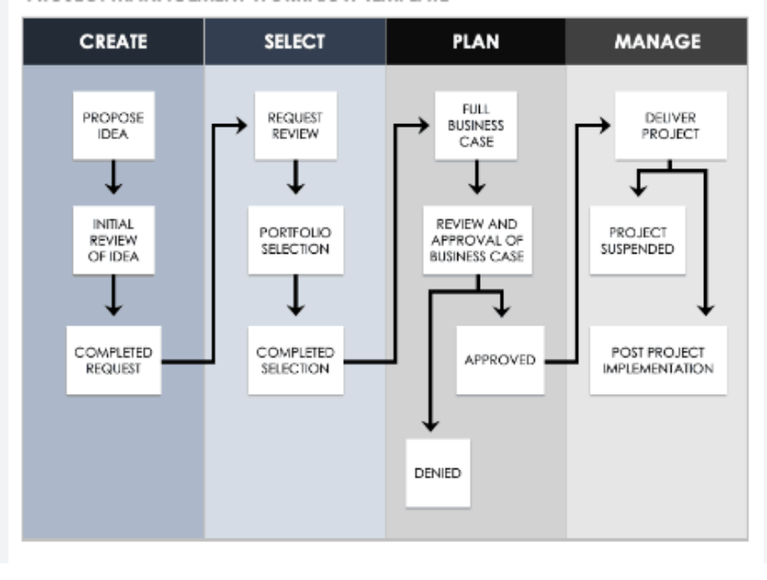

# Content

1. Problem - Background And Benefits -

2. Approach - Workflow And Implementation - 

3. Project Management Overview

---

class: inverse, center, middle
# Problem 
## Background And Benefits

---

# Urban Heat Island (UHI) in the Phoenix, Arizona

- Conversion of land usage - hotter than the surrounding desert
- Usage of AC makes outside spaces hotter especially during the night
- Tends to be most intense in the low income areas - more than half of the people who died in 2020 from heat were homeless

```{r echo = FALSE, out.width='75%', fig.align='center'}
knitr::include_graphics("uhi.jpg")
```


---

# Impacts of UHI in Phoenix

---

# Cost of the UHI in Phoenix

```{r echo = FALSE, out.width='75%', fig.align='center'}
knitr::include_graphics("cost.png")
```
---

---

# Global Policies regarding UHI

---

# Local Policies regarding UHI in Phoenix 

---

# Benefit of the UHI in Phoenix 

```{r echo = FALSE, out.width='75%', fig.align='center'}
knitr::include_graphics("benefit_cost.png")
```

---

class: inverse, middle, center

# Approach

---


---

class: inverse, middle, center

# Project plan

---
class: center, middle
# Workflow And Implementation
---
# Overall Workflow
(sample)

---
# Implementation1

The implementation section describes the planning of planting trees, which is divided into 3 parts:

**1.Preliminary Preparation: Bus Stop Survey**
- Identify if the bus stop is suitable for tree plangting
- Check if there is:
  + Adequate aboveground space
  + Pavement requiring removal before planting
  + Irrigation in-place

**2. Planting**
- Type: Mesquite tree
- One tree at each bus stop

**3. Maintenance**
- Prune
  + Ensuring a strong structure
- Irrigation
  + In-place irrigation
  + Cost are divided into equipment installation and water charges
  
---
# Implementation2

The budget of implementation section is as the following:


- Select the bus stops that are not built on the pavement (no removal cost)
- The calculation is based on 52 weeks a year
- Totally 300 trees and 3 years

Budget  = ＄500 (Survey) + 300 * (＄65 (tree) + ＄250 (pruning) + ＄250 (Planting Hole) + 0.30*52*3 (water) )= ＄184,040
---


