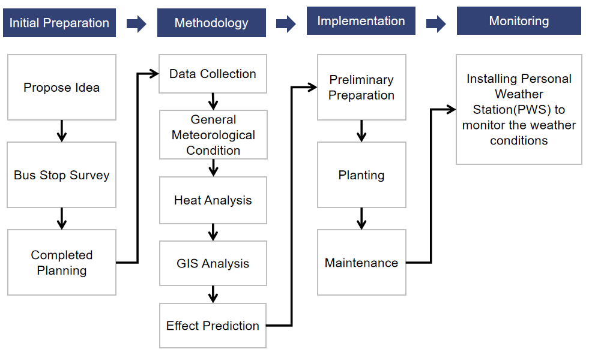
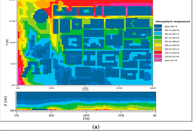

```{r xaringan-themer, include=FALSE, warning=FALSE}
library(xaringanthemer)
style_duo_accent(primary_color="#023020", secondary_color = "#cfc493", text_font_size="1rem",header_h1_font_size="1.6rem",header_h2_font_size="1.4rem",header_h3_font_size="1.2rem")
```

```{r, load_refs, include=FALSE, cache=FALSE}
library(RefManageR)
BibOptions(check.entries = FALSE,
           bib.style = "authoryear",
           cite.style = "authoryear",
           style = "markdown",
           hyperlink = TRUE,
           dashed = FALSE,
           no.print.fields=c("doi", "urldate", "issn"))
myBib <- ReadBib("references.bib", check = FALSE)
```    

class: inverse, center, middle
# ~ Problem ~ 
### Problem Definition
### Cost of Problem 
### Current Policies
### Our project 

---

# Problem Definition - Urban Heat Island (UHI) in Phoenix, Arizona
* Known as "the country's hottest and fifth populous city" `r Citep(myBib,"lakhani_americas_2022")`
  + Heat Situation 
     - 110°F (43.3°C) or higher for 22 days `r Citep(myBib,"lakhani_americas_2022")`
     - 75% of the nights higher than 80°F (43.3°C) `r Citep(myBib,"lakhani_americas_2022")`
     - Urban areas higher by 3°F at morning, 12°F at night for atmosphere - more intense on the surface temperature and thermal index `r Citep(myBib,"hondula_urban_2020")`
  + Population growth 
     - City growing through "urban sprawl" - the rapid conversion in to urban areas from agricultural land with poor land management `r Citep(myBib,"hondula_urban_2020")`
     - The fastest growing urban metropolitan area in the US for five years (2016-2021) `r Citep(myBib,"city_of_phoenix_phoenix_2021")`
     
.center[
     
     
** What is the relationship between these two factors?**]


---

# Problem Definition - Urban Heat Island (UHI) in Phoenix, Arizona

**Urbanisation as the main driver of UHI**

- Remote sensing data showing conversion to urban, residential and impervious surfaces and decrease in vegetation as the leading cause for the increase in temperature in Phoenix `r Citep(myBib,"wang_spatio-temporal_2016")`
- Effects found most intense in areas with high socio-economic vulnerability based with higher temperatures and less vegetation `r Citep(myBib,"moss_socio-economic_2020")`

```{r echo = FALSE, out.width='60%', fig.align='center'}
knitr::include_graphics("uhi.jpg")
```
.center[Driving factors of Urban Heat Island in Phoenix - Source: [ASU](https://www.phoenix.gov/oepsite/Documents/PHX.UHITS.Hondula.Sept2020.pdf)]
---

# Cost of UHI in Phoenix

## Public Health

- Heat associated deaths per year show an increasing trend within the county `r Citep(myBib,"baker_2021_2021")`
- Tends to be most intense in the low income areas - more than half of the people who died in 2020 were homeless, disproportionately represented by African Americans and Indigenous groups `r Citep(myBib,"lakhani_as_2022")`

.center[Heat Associated Deaths in Maricopa County - Source: [Maricopa County](https://www.maricopa.gov/DocumentCenter/View/74257/Final-2021-Heat-Deaths#:~:text=338%20heat%2Dassociated%20deaths%20were,a%2069.8%25%20increase%20from%202019.&text=The%20proportion%20of%20indoor%20heat,also%20been%20increasing%20each%20year)]

```{r echo = FALSE, out.width='75%', fig.align='center'}

```


---

# Cost of UHI in Phoenix

.pull-left[
## Environmental 

- 1°F increase in daily low temperatures associated with 290 gallons increase an average monthly usage of water for a typical
single-family unit `r Citep(myBib,"guhathakurta_impact_2007")`

## Economic

- Urban Heat Island as **"an unintended urbanization tax on every resident, business, and municipal facility"** `r Citep(myBib,"miner_efficiency_2017")`
]

.pull-right[

<br>
<br>

```{r echo = FALSE, out.width='80%', fig.align='center'}
knitr::include_graphics("cost.png")
```

.center[Source: [AECOM & the Nature Conservatory](https://www.nature.org/content/dam/tnc/nature/en/documents/TNC_EcoHeatAssement_AZ_Report.pdf)
]
]

---

# Global Policies regarding UHI

## New Urban Agenda

- "We commit ourselves to the generation and use of renewable and affordable energy and sustainable and **efficient transport infrastructure and services**, where possible, **achieving the
benefits of connectivity and reducing the financial, environmental and public health costs of** inefficient mobility, congestion, air pollution, **urban heat island effects** and noise" `r Citep(myBib,"united_nations_new_2017")`

## SDGs 

- "Investing in parks and **green spaces in urban areas** will help to ameliorate the urban heat island effect and improve air quality in urban spaces." `r Citep(myBib,"united_nations_environment_programme_sdg_2018")`

## Beat the Heat Handbook

- controlling the heat island effect at the city scale by "zoning statutes, urban planning regulations for mitigating heat islands, **transport planning** and **mandates for green cover**" `r Citep(myBib,"united_nations_environment_programme_beating_2021")`

---

# Local Policies regarding UHI 

## Phoenix Climate Action Plan 

**Heat Section - 2050 goal `r Citep(myBib,"phoenix_climate_2021")`** 

- Reduce urban heat-island effect through green infrastructure as well as **doubling the current tree and shade canopy to 25%**
- Have all residents within a five-minute walk from a park
or open space by adding new parks or open space in underserved areas,
adding 150 miles of paths, greenways, and bikeways throughout the city, and transforming an additional 150 miles of
canals into vibrant public space

**What are the estimated benefits of this policy?**

.center[Benefit-Cost Analsysis for Solution Scenario (2020-2059)]

| Solution Scenario | Benefit | Cost | B-C Ratio |
|:-------:|:------:|:------:|:------:|
| 25% Urban Tree Canopy Cover | $15.3 billion | $4.0 billion | 3.78 |

.center[Source: [AECOM & the Nature Conservatory](https://www.nature.org/content/dam/tnc/nature/en/documents/TNC_EcoHeatAssement_AZ_Report.pdf)]


**However...** Very slow progress (original goal set in 2030) `r Citep(myBib,"montanari_will_2020")`

---
# UHI and Transporation
** Focus on the transportation - how does the UHI problem intersect with this particular sector?**

Transportation as cause of UHI 
* Auto-centric design of the city - Low density urban area with city growth based on urban sprawl `r Citep(myBib,"hoehne_urban_2022")`
  +  High private vehicle usage 
     - 18.9% of income spent on transportation - highest among the 22 metropolitan areas in the U.S. `r Citep(myBib,"us_bureau_of_labor_statistics_consumer_2022")`
     - 85% travel by passenger automobile, 1.7% by bus `r Citep(myBib,"phoenix_climate_2021")`
     
     

Modes of Transport and UHI
* High reliance on public transport in low-income communities which are found vulnerable to heat `r Citep(myBib,"the_nature_conservatory_heat_2020")`


---
# UHI and Transportation

.pull-left[
**Current Efforts**</br>
[`"Phoenix 2050 Transportation Plan"`](https://www.phoenix.gov/publictransitsite/MediaAssets/T2050_flyer.pdf)</br>

Mainly focusing on ridership but little on thermal conditions, installing shade structures is the only heat action `r Citep(myBib,"watkins_strategic_2017")`

]
.pull-right[
**Our Project**</br>
[`Green Bus Stop Project`](https://ntsuchiyama.github.io/CASA0023_group_presentation/)</br>
</br>
- Planting trees for bus stops 
- Focusing on green space and thermal conditions for increasing bus usage and achieving policy goals
]
</br>
</br>

</br>
Sources:[WIKIMEDIA COMMONS](https://commons.wikimedia.org/wiki/File:Zen_bus_stop.jpg), [IEEE](https://earthzine.org/strategic-shade-using-nasa-earth-observations-to-identify-the-hottest-bus-stops-in-phoenix/)
---

class: inverse, middle, center

# ~ Approach ~

### Workflow
### Explanation of work packages 
#### (Initial preparation, Methodology, Implementation, Monitor)
### Allignment with Policy

---
# Workflow


---
# Initial Preparation
## Proposing Idea
Planting trees for some hot bus stops to provide shade for people 

## Bus Stop Survey (Based on previous work `r Citep(myBib,"watkins_strategic_2017")`)
- 4,038 bus stops within city boundaries
- 2,850 of those stops have passenger shelters as of 2017 
- No tree planting plan for bus stop
- *Nearly 1000 bus stops have no any shade function*
- Community interaction

## Completed Plan
- Planting trees for the top hottest 40% bus top with no shelters
- Totally planting 400 trees

---
# Methodology - Current approaches and issues
## Current approach
* Fine-scale modeling of the urban heat island `r Citep(myBib,"oukawa_fine-scale_2022")`

  + Development of MLR and RF regression models (for both daytime and nighttime) to explore the spatiotemporal evolution of the UHI, using air temperature as the response variable
  
  + The division of the models into two periods based on previous studies that reported significant differences between the daytime and nighttime UHI 

## Issues

1. Mostly Large scale research on UHI
2. Datasets are not long-term data, using one season temperature data to train the model instead of yearly data.

---
# Methodology - Overall

Data sets for detecting and classifying bus stops which have high temperature problem
```{r echo=FALSE, out.width='60%', fig.align='center'}
knitr::include_graphics('image/DATA.jpg')
```

Progress
```{r echo=FALSE, out.width='70%', fig.align='center'}
knitr::include_graphics('image/Process.jpg')
```
 
---
# Methodology - General Meteorological condition
.pull-left[
- **Data: 
To get general condition** </br>
1. Use National Centers for Environmental Information time series data to get average/ highest temperature condition in Phoenix from year 2017 to 2022; </br>
</br>
</br>
2. Use National Centers for Environmental Information mapping data to get high heat distribution in Phoenix from year 2017 to 2022. 
]
.pull-right[
.center[**Possible Outputs**


Source: [NCEI](https://www.ncei.noaa.gov/access/monitoring/climate-at-a-glance/city/mapping/2/tavg/201701/1/value)
]
]

---
# Methodology - Land surface temperature
.pull-left[
1. Obtain Landsat 8 Data and select bands
Obtain every first day Landsat 8 data for each month from 2017 to 2022 - Make sure they have low cloud cover rate
2. Atmospheric correction: To increase accuracy of the temperature measurements
3. Convert digital numbers to radiance: The thermal bands of Landsat 8 provide data (TIRS1 and TIRS2) in digital numbers (DN).
4. Calculate the brightness temperature and land surface temperature: calculated using the radiance values from the thermal bands and the Planck's law -use the result and emissivity to get LST
]
.pull-right[
.center[
**Possible Output**

```{r echo=FALSE, out.width='80%', fig.align='center'}

```


Source: [GIScrack](https://giscrack.com/how-to-calculate-land-surface-temperature-with-landsat-8-images/) 
]
]
---
# Methodology - Select Bus stops
.pull-left[**Data: Bus stops geographic data; LST**

- Connect bus stops with LST result through spatial join (QGIS)
</br>
</br>
- Select bus stops which had a high rate to have high temperature in one year, then select top 30% of those bus stops - These selected bus stops are objects we focus on in near future.]

.pull-right[
.center[
**Possible Output** 


```{r echo=FALSE, out.width='80%', fig.align='center'}
knitr::include_graphics('image/StrategicShade2.jpg')
```


Source: [IEEE](https://earthzine.org/strategic-shade-using-nasa-earth-observations-to-identify-the-hottest-bus-stops-in-phoenix/) 
]
]
---
# Methodology - ENVI-MET

ENVI-MET is a microclimate simulation software that can be used to model and analyze the microclimate of outdoor spaces. The software can simulate and analyze various environmental parameters such as air temperature, wind speed, humidity, and solar radiation.
- We put the meteorological data and bus stops data into ENVI-MET to simulate meteorological conditions near a bus stop. After simulating the conditions, we set the temperature parameter after planting trees to predict the condition after planting trees near the bus stop.

.pull-left[]
.pull-right[
]

.center[ENVI-Met Model (L) Detection (R) Output - Source: [Ambrosini *et al.* 2014](https://www.mdpi.com/2071-1050/6/10/7013)
]
---
# Methodology - Limitation and Extensions
## Limitation
- The resolution of thermal infrared data collected by thermal infrared sensors mounted on remote sensing satellites is generally low. The thermal infrared band resolution of Landsat5 TM data is 120 meters, and the thermal infrared band resolution of Landsat8 TIRS data is 100 meters.

- It is difficult to obtain image data at the same time of each year because each remote sensing satellite has a different operating period, and the revisit period for the same latitude and longitude area is also inconsistent.

## Extension

- A single model is not enough to match the complex evolution characteristics of the urban heat island.It still needs more advanced technology and multidisciplinary integration.

---
# Implementation - Planting Trees

The implementation section describes the planning of planting trees, which is divided into 3 parts:

**1.Preliminary Preparation**
- Identify if the bus stop is suitable for tree planting
- Check if there is:
  + Adequate overground space
  + Pavement requiring removal before planting
  + Irrigation in-place

**2. Planting**
- Type: Mesquite tree - start with one tree at each bus stop

**3. Maintenance**
- Irrigation
  + In-place irrigation
  + Cost are divided into equipment installation and water charges
---

# Monitor - Evaluation of Project


## Monitoring the effect after implementation


---
# Monitor - Personal Weather Station (PWS)


.center[PWS Work Process - Personal Weather Station (PWS) <br> Source: [Weather Underground](https://www.wunderground.com/pws/overview)]

---
# Monitor - Personal Weather Station (PWS)
## Features of PWS 

- Precision: Get weather conditions for users' exact location (not their neighbor’s)

- Visualization: See comprehensive dashboards and graphs of users' station data

- Historical: Archive  historical data so users can always look back

- Share: Share user data and help supplier improve weather forecasting for everyone

## Limitation

- Data maybe affected by surrounding buildings

- Weather data is homogeneous and prone to human activities

---
# How does our approach lie within current global and local policies?

.pull-left[
- Temperatures are expected to lower by the simulation results in the bus spots - combat UHI effect


.footnote[Source:[Bing](https://th.bing.com/th/id/OIP.SLV4UTFniHdbucbFBRB-8wHaHa?w=179&h=180&c=7&r=0&o=5&pid=1.7)]
]

.pull-right[
- Citizens are provided with shades around bus stops - may encourage the usage of public transport, an initial step for more sustainable tranport methods


.footnote[Source:[Newoss](https://newoss.zhulong.com/tfs/pic/v1/tfs/T1NECvB4_T1RCvBVdK.jpg?x-oss-process=image/resize,w_760)]
]


---

class: inverse, middle, center

# ~ Project plan ~ 
### Timeframe and budget
### Risk and Limitations
---
# Cost of Planting Trees

The budget of implementation section is as the following `r Citep(myBib,"mcpherson_cost_1991")`:


- Select the bus stops that are not built on the pavement (no removal cost)
- The calculation is based on 52 weeks a year
- Totally 300 trees and 1 years

Budget  = ＄500 (Survey) + 300 * (＄65 (tree) + ＄250 (Planting Hole) + 0.30*52*1 (water) )= ＄99,680

---
# Cost of ENVI-met and PWS

.pull-left[
## ENVI-met
`Prediction before implementation`
- Buying commercial vision
- Budget = €2900 = ＄3102


]

.pull-right[
## PWS
`Monitor after implementation`
- Installing for each bus stop
- Totally 300
- Budget = 300 * ＄1000 = ＄30,000


]

---
# Cost of Labour
The project group consists of 1 project manager, 2 government strategic researchers and 4 geographic cartographers


</br>Working before implementation:
- **A strategic researcher** is paid $86,717 per year
  + Paid per month = ＄86,717 / 12 = ＄7,226
- **A geographic cartographer** is paid $68,900 per year
  + Paid per month = ＄68,900 / 12 = ＄5,741

Working before and during implementation:
- **A project manager** is paid $82,822 per year
  + Paid per month = ＄82,822 / 12 = ＄6,901
---
# Project Managemenet
Total Funding = ￡500,000 = ＄610,200
</br>
Estimated Spending Plan = ＄600,753
</br>
**Remainder = ＄610,200 - ＄600,753 = ＄9447**


---
# Project Risks and Limitations
.pull-left[
## Risks
- Cost risk
  + Over budget
</br>
- External hazards risk
  + Monitoring equipment damage
</br>
- Performance risk
  + Can not finish planting 300 trees in 3 months
</br>
- Communication risk
  + The group could not reach an agreement among the three parties
]

.pull-right[
## Limitations
- Unable to implement this project at all bus stops due to the funding limitation
</br>
- Only bus stops that are not built on pavement can be selected for implementation because of the higher removal cost. 
]
---

# References

```{r, results='asis', echo=FALSE}
PrintBibliography(myBib, start = 1, end = 5)
```
---
# References

```{r, results='asis', echo=FALSE}
PrintBibliography(myBib, start = 6, end = 10)
```

---

# References

```{r, results='asis', echo=FALSE}
PrintBibliography(myBib, start = 11, end = 15)
```

---

# References

```{r, results='asis', echo=FALSE}
PrintBibliography(myBib, start = 16, end = 20)
```

