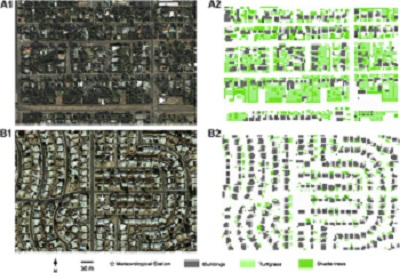

# Content

1. Problem 

2. Approach 

3. Project Management 

---

class: inverse, center, middle
# Problem 
## Problem Definition 
## Policies 
## Term Explanation

---

# Problem Definition
## Urban Heat Island (UHI) in Phoenix, Arizona
- "the country's hottest and fifth populous city" (https://www.theguardian.com/us-news/2022/jan/27/phoenix-arizona-hottest-city-cooling-technologies)
- Urbannisation as the maindriver of UHI - conversion to urban, residential and impervious surfaces (citation )
- The population growth has led to a huge expansion in concrete infrastructure (buildings, roads and carparks) and a reduction in green areas, which has created heat islands – dangerously hot urban areas that absorb and re-emit the sun’s heat more than natural landscapes.

- 53 days above 113°F (43°C) in 2020 ()


```{r echo = FALSE, out.width='75%', fig.align='center'}
knitr::include_graphics("uhi.jpg")
```


---

# Cost of the UHI in Phoenix

## Environmental 

## Public Health

- Tends to be most intense in the low income areas - more than half of the people who died in 2020 from heat were homeless [add citation]
- Mean 

```{r echo = FALSE, out.width='75%', fig.align='center'}
knitr::include_graphics("death.png")
```

---

# Cost of the UHI in Phoenix

## Economic

**City Level**

```{r echo = FALSE, out.width='60%', fig.align='center'}
knitr::include_graphics("cost.png")
```


---

# Global Policies regarding UHI

## New Urban Agenda

- "reducing the financial, environmental and public health costs of inefficient mobility, congestion, air pollution, urban heat island effects and noise"

## SDGs 

- "Investing in parks and green spaces in urban areas will help to ameliorate the urban heat island effect and improve air quality in urban spaces."

---

# Local Policies regarding UHI 

## Phoenix Climate Action Plan

### Heat Section - 2050 goal

- Reduce urban heat-island effect through *green infrastructure as well as doubling the current tree and shade canopy to 25% (add citation )

* green infrastructure - 


---

# Benefit of the UHI in Phoenix 

```{r echo = FALSE, out.width='75%', fig.align='center'}
knitr::include_graphics("benefit_cost.png")
```


---

# UHI and Transporation 

**Cause**
- low density city structure based urban sprawl into the deserts increases car usage (citation)
- car 

**Impact**
- community efforts and interventions demonstrating high reliance on public transport in low-income communities found vulnerable to heat [add citation]

**Current Efforts**
- Phoenix 2050 Transportation Plan - Providing shade structures to bus stops https://www.phoenix.gov/publictransitsite/MediaAssets/T2050_flyer.pdf
- Current criteria for prioritisation mainly on ridership with little attention on thermal conditions (citation) 

- tackling UHI from both cause and impact & achieving policies on green infrastructure and tree canopy through **Green Bus Stop Project**
---
# UHI and Transporation
**Causes & Impacts**
- Low density city structure based urban sprawl into the deserts increases bus and car usage. 
- High reliance on public transport in low-income communities found vulnerable to heat.
- Phoenix is expected to double in population over the next 30 years.
.pull-left[
**Current Efforts**</br>
[`"Phoenix 2050 Transportation Plan"`](https://www.phoenix.gov/publictransitsite/MediaAssets/T2050_flyer.pdf)</br>
Mainly focusing on ridership but little on thermal conditions, installing shade structures at all bus stop is the only heat action.
]
.pull-right[
**Our Project**</br>
[`Green Bus Stop Project`](https://ntsuchiyama.github.io/CASA0023_group_presentation/)
Planting trees for bus stops and focusing on green space and thermal conditions.
]


---

class: inverse, middle, center

# Approach

## Workflow
## Methodology
## Output 
## Implementation
## Allignment with Policy

---
# Workflow


---
# Initial Preparation
## Proposing Idea
Planting 

---
# Approach - Current approach and issues
## Current approach
- Fine-scale modeling of the urban heat island
-- Researcher Oukawa, Krecl and Targino developed MLR and RF regression models (for both daytime and nighttime) to explore the spatiotemporal evolution of the UHI, using air temperature (Tair) as the response variable. The division of the models into two periods is based on previous studies that reported significant differences between the daytime and nighttime UHI in Londrina .link-style2[[(Oukawa, Krecl and Targino, 2022)](https://www.sciencedirect.com/science/article/pii/S0048969721079158?casa_token=u1Tr3PPqF1UAAAAA:HGHv9wsjmabtqhFFaGmQlJeyjjOVJztmETaYU7HPRd2eXgOCsn-iN82C_btCBOB6ID5Zdh0nnUg)]

## Issues

1. Mostly Large scale research on UHI
2. Datasets are not long-term data, using one season temperature data to train the model instead of yearly data.

---
# Approach - Methodology

Data sets for detecting and classifying bus stops which have high temperature problem
```{r echo=FALSE, out.width='70%', fig.align='center'}

```

Progress
```{r echo=FALSE, out.width='80%', fig.align='center'}
knitr::include_graphics('image/Process.jpg')
```
 
---
# Approach - General Meteorological condition
.pull-left[
- Data: 
To get general condition: </br>
1. Use National Centers for Environmental Information time series data to get average/ highest temperature condition in Phoenix from year 2017 to 2022; </br>
2. Use National Centers for Environmental Information mapping data to get high heat distribution in Phoenix from year 2017 to 2022. ]
.pull-right[
```{r echo=FALSE, out.width='80%', fig.align='center'}
knitr::include_graphics('image/Screenshot 2023-03-19 193636.png')
knitr::include_graphics('image/Screenshot 2023-03-19 193222.png')
```
Source: [NCEI](https://www.ncei.noaa.gov/access/monitoring/climate-at-a-glance/city/mapping/2/tavg/201701/1/value) 
]

---
# Approach - Land surface temperature
.pull-left[
1. Obtain Landsat 8 Data and select bands
Obtain every first day Landsat 8 data for each month from 2017 to 2022. Make sure they have low cloud cover rate.
2. Atmospheric correction: To increase accuracy of the temperature measurements. 
3. Convert digital numbers to radiance: The thermal bands of Landsat 8 provide data (TIRS1 and TIRS2) in digital numbers (DN).
4. Calculate the brightness temperature and land surface temperature: It is calculated using the radiance values from the thermal bands and the Planck's law.Then use the result and emissivity to get LST.
]
.pull-right[
```{r echo=FALSE, out.width='80%', fig.align='center'}
knitr::include_graphics('image/LST-Landsat-calcular-la-temperatura-de-superficie.jpg')
```
Source: [GIScrack](https://giscrack.com/how-to-calculate-land-surface-temperature-with-landsat-8-images/) 
]
---
# Approach -Select Bus stops
Data: Bus stops geographic data; LST
- Connect bus stops with LST result through spatial join. (QGIS)
- Select bus stops which had a high rate to have high temperature in one year, then select top 30% of those bus stops. These selected bus stops are objects we focus on in near future.
{width=80,position:left}
Source: [IEEE](https://earthzine.org/strategic-shade-using-nasa-earth-observations-to-identify-the-hottest-bus-stops-in-phoenix/) 

---
# Approach - ENVI-MET

ENVI-MET is a microclimate simulation software that can be used to model and analyze the microclimate of outdoor spaces. The software can simulate and analyze various environmental parameters such as air temperature, wind speed, humidity, and solar radiation.
- We put the meteorological data and bus stops data into ENVI-MET to simulate meteorological conditions near a bus stop. After simulating the conditions, we set the temperature parameter after planting trees to predict the condition after planting trees near the bus stop.
.pull-left[
Source:[](https://www.mdpi.com/sustainability/sustainability-06-07013/article_deploy/html/images/sustainability-06-07013-g007-1024.png)]
.pull-right[
Source:[](https://ars.els-cdn.com/content/image/1-s2.0-S0360132311002411-gr2.jpg)]

---

# Approach - Output


{width=50}


---

# Approach - Limitation and Extensions
- Bus stops data needs to be collected
- Hard to simulate how well trees would effect temperature condition, so just set one unit reduced.

- limitation 

---
# Implementation-Planting Trees

The implementation section describes the planning of planting trees, which is divided into 3 parts:

**1.Preliminary Preparation**
- Identify if the bus stop is suitable for tree plangting
- Check if there is:
  + Adequate aboveground space
  + Pavement requiring removal before planting
  + Irrigation in-place

**2. Planting**
- Type: Mesquite tree
- One tree at each bus stop

**3. Maintenance**
- Prune
  + Ensuring a strong structure
- Irrigation
  + In-place irrigation
  + Cost are divided into equipment installation and water charges
---

## Monitor and Evaluation

choosing final 

---
## Personal Weather Station(PWS)


.footnote[ *PWS Work Process.Image Source:[https://www.wunderground.com/pws/overview](https://www.wunderground.com/pws/overview)]

---
## Features of PWS

- Precision: Get weather conditions for users' exact location (not their neighbor’s)

- Visualization: See comprehensive dashboards and graphs of users' station data

- Historical: Archive  historical data so users can always look back

- Share: Share user data and help supplier improve weather forecasting for everyone

## Limitation

- Data maybe affected by surrounding buildings

- Weather data is homogeneous and prone to human activities

---
## How our approach answers policies

.pull-left[
- Temperatures are expected to lower by 0.5-1.5 degree in specific spots


.footnote[Source:[Bing](https://th.bing.com/th/id/OIP.SLV4UTFniHdbucbFBRB-8wHaHa?w=179&h=180&c=7&r=0&o=5&pid=1.7)]
]

.pull-right[
- Citizens are provided with more shades around bus stops


.footnote[Source:[Newoss](https://newoss.zhulong.com/tfs/pic/v1/tfs/T1NECvB4_T1RCvBVdK.jpg?x-oss-process=image/resize,w_760)]
]

---

class: inverse, middle, center

# Project plan
## Timeframe and budget
---
# Cost of Planting Trees

The budget of implementation section is as the following:


- Select the bus stops that are not built on the pavement (no removal cost)
- The calculation is based on 52 weeks a year
- Totally 300 trees and 1 years

Budget  = ＄500 (Survey) + 300 * (＄65 (tree) + ＄250 (pruning) + ＄250 (Planting Hole) + 0.30*52*3 (water) )= ＄184,040
---
# Project Managemenet


---
# Risks and Limitations


